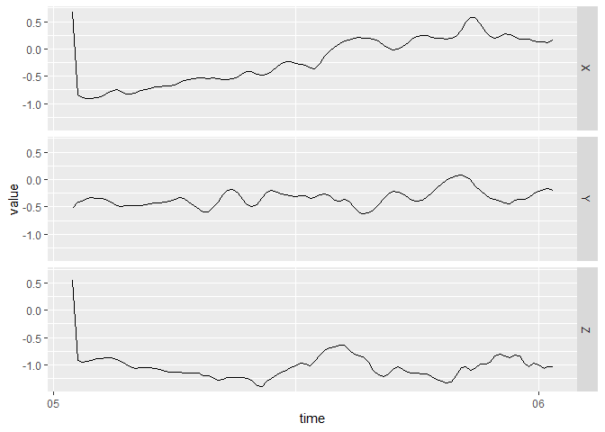

<!-- README.md is generated from README.Rmd. Please edit that file -->

# bis620.2022

<!-- badges: start -->

[](https://github.com/nanxi0707/bis620.2022/actions/workflows/R-CMD-check.yaml)
[](https://github.com/nanxi0707/bis620.2022/actions/workflows/test-coverage.yaml)
<!-- badges: end -->

The goal of bis620.2022 is to capture functions, data, and documentation
for BIS620. You can use this package to plot the UKBiobank Accelerometry
Data and get the Spectral Signature of Accelerometry Data.

[lint
result](https://github.com/nanxi0707/bis620.2022/actions/workflows/lint.yaml)

[coverage
page](https://github.com/nanxi0707/bis620.2022/actions/workflows/test-coverage.yaml)

## Installation

You can install the development version of bis620.2022 from
[GitHub](https://github.com/) with:

``` r
# install.packages("devtools")
devtools::install_github("nanxi0707/bis620.2022")
```

## Example

This is a basic example which shows you how to solve a common problem:

``` r
library(bis620.2022)
## basic example code
data(ukb_accel)
accel_plot(ukb_accel[1:100, ])
```



``` r
spec_sig(ukb_accel[1:100, ], take_log = TRUE)
#> # A tibble: 50 × 4
#>         X     Y      Z  freq
#>     <dbl> <dbl>  <dbl> <dbl>
#>  1  2.98  3.52   4.64   1.01
#>  2  3.26  1.44   1.43   1.03
#>  3  2.10  1.44   2.26   1.05
#>  4  2.01  1.36   1.58   1.08
#>  5  0.438 1.01   1.01   1.10
#>  6  1.46  0.737 -0.199  1.12
#>  7  0.961 0.962  1.05   1.15
#>  8  1.35  1.06   0.935  1.18
#>  9  1.29  1.06  -1.44   1.20
#> 10 -0.148 0.957  1.04   1.23
#> # … with 40 more rows
```
